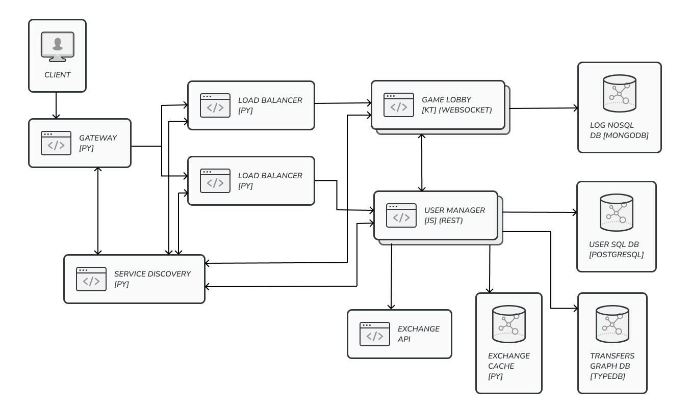

# Online Blackjack Game

## Application Suitability
* **Real-Time Communication**: The game requires real-time communication between the client and the server to get the latest results of the game.
    *Example*: Multiuser chat applications:
    * Discord - Real-time communication between users in chat rooms.
* **Redundancy and Scalability**: The game should be able to handle a large number of users and should be able to scale horizontally and reduce downtime in case of server failure.
    *Example*: Media platforms:
    * Netflix - Localized servers to reduce latency and increase availability.

* **Separation of Logic and Data**: The game logic should be separated from the data storage to allow for easier scaling and maintenance.
    *Example*: Games with progression systems:
    * Fornite - Gameplay logic is separated from individual progression.

## Service Boundaries


#### Services
* The **Game Lobby** service will be a cluster managed by a load balancer and will handle the game logic and communication with the clients.
* The **User Manager** service will be a separate cluster managed by a load balancer and will handle user authentication and authorization with additional data manipulation options.
* The **Exchange API** service is a remote service that will be used to get the latest exchange rates for the game and stocked in the **Exchange Cache**.

#### Databases
* The **User SQL Database** will store user data such as username, password, email, and balance.
* The **Transfers Graph Database** will store the transfer history between users.
* The **Log NoSQL Database** will store the logs of the game.

## Technology Stack
#### Communication:
* **Gateway**: Python
* **Service Discovery**: Python
* **Load Balancer**: Python

#### Services:
* **Game Lobby**: Kotlin
* **User Manager**: JavaScript

#### Databases:
* **User SQL Database**: PostgreSQL
* **Transfers Graph Database**: TypeDB
* **Log NoSQL Database**: MongoDB
* **Exchange Cache**: Python (custom cache)

<!-- TODO: Why WS? Why REST? Why gRPC? -->

## Data Management
* Health (all services):
    * `GET /status` - Returns the status of the service.
* **Game Lobby**:
    * User endpoints:
        * `rpc /join` - Join a game.
            * Request headers:
            ```
            ...
            Authorization: Bearer <token>
            ...
            ```
            * Response body 200:
            ```json
            {
                "message": "Game joined"
            }
            ```
            * Response body 401 (missing or bad token):
            ```json
            {
                "message": "Unauthorized"
            }
            ```
        * `rpc /bet` - Place a bet in the game.
            * Request headers:
            ```
            ...
            Authorization: Bearer <token>
            ...
            ```
            * Request body:
            ```json
            {
                "amount": "number"
            }
            ```
            * Response body 200:
            ```json
            {
                "message": "Bet successful"
            }
            ```
            * Response body 400:
            ```json
            {
                "message": "Invalid bet"
            }
            ```
            * Response body 401 (missing or bad token):
            ```json
            {
                "message": "Unauthorized"
            }
            ```
        * `rpc /action` - Perform an action in the game.
            * Request headers:
            ```
            ...
            Authorization: Bearer <token>
            ...
            ```
            * Request body:
            ```json
            {
                "action": "string"
            }
            ```
            * Response body 200:
            ```json
            {
                "message": "Action successful"
            }
            ```
            * Response body 400:
            ```json
            {
                "message": "Invalid action"
            }
            ```

        * `rpc /leave` - Leave the game.
            * Request headers:
            ```
            ...
            Authorization: Bearer <token>
            ...
            ```

* **User Manager**:
    * User endpoints:
        * `POST /register` - Create a new user.
            * Request body:
            ```json
            {
                "username": "string",
                "password": "string",
                "email": "string",
                "balance": "number"
            }
            ```
            * Response body 201:
            ```json
            {
                "token": "string"
            }
            ```
            * Response body 400:
            ```json
            {
                "message": "User already exists"
            }
            ```

        * `GET /login` - Log in a user.
            * Request body:
            ```json
            {
                "username": "string",
                "password": "string"
            }
            ```
            * Response body 200:
            ```json
            {
                "token": "string"
            }
            ```
            * Response body 401:
            ```json
            {
                "message": "Unauthorized"
            }
            ```
        * `GET /profile` - Get the user's profile.
            * Request headers:
            ```
            ...
            Authorization: Bearer <token>
            ...
            ```
            * Response body 200:
            ```json
            {
                "username": "string",
                "email": "string",
                "balance": "number"
            }
            ```
            * Response body 401 (missing or bad token):
            ```json
            {
                "message": "Unauthorized"
            }
            ```
        * `POST /transfer` - Transfer money between users.
            * Request headers:
            ```
            ...
            Authorization: Bearer <token>
            ...
            ```
            * Request body:
            ```json
            {
                "username": "string",
                "amount": "number"
            }
            ```
            * Response body 200:
            ```json
            {
                "message": "Transfer successful"
            }
            ```
            * Response body 400:
            ```json
            {
                "message": "Insufficient funds"
            }
            ```
            * Response body 401 (missing or bad token):
            ```json
            {
                "message": "Unauthorized"
            }
            ```
            * Response body 404:
            ```json
            {
                "message": "User not found"
            }
            ```
    * Game endpoints (for the **Game Lobby** service secured with a different token):
        * `GET /balance/user_id=<user_id>` - Get the user's balance.
            * Request headers:
            ```
            ...
            Authorization: Bearer <token>
            ...
            ```
            * Response body 200:
            ```json
            {
                "balance": "number"
            }
            ```
            * Response body 401 (missing or bad token):
            ```json
            {
                "message": "Unauthorized"
            }
            ```
            * Response body 404:
            ```json
            {
                "message": "User not found"
            }
            ```
        * `PUT /balance/user_id=<user_id>` - Update the user's balance.
            * Request headers:
            ```
            ...
            Authorization: Bearer <token>
            ...
            ```
            * Request body:
            ```json
            {
                "balance": "number"
            }
            ```
            * Response body 200:
            ```json
            {
                "message": "Balance updated"
            }
            ```
            * Response body 401 (missing or bad token):
            ```json
            {
                "message": "Unauthorized"
            }
            ```
            * Response body 404:
            ```json
            {
                "message": "User not found"
            }
            ```


## Deployment and Scaling
The services will be deployed using Docker.
The **Game Lobby** and **User Manager** services will be deployed with replicas to handle the load and reduce downtime in case of server failure.
The **Exchange Cache** will be deployed as a separate service to handle the exchange rate caching in order to reduce the load on the **Exchange API** service. Will have an expiration time of 1 hour and will only be populated if unexisting or expired data is requested.

<!-- TODO: Explain Docker replicas mechanism. -->
