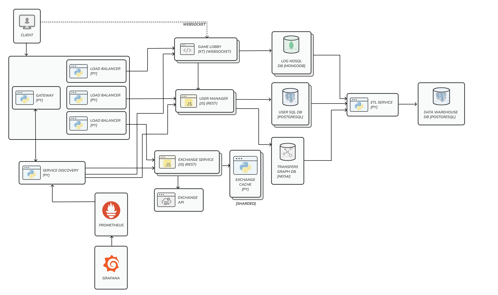

# Online Blackjack Game

## Application Suitability
* **Real-Time Communication**: The game requires real-time communication between the client and the server to get the latest results of the game.
    *Example*: Multiuser chat applications:
    * Discord - Real-time communication between users in chat rooms.
* **Redundancy and Scalability**: The game should be able to handle a large number of users and should be able to scale horizontally and reduce downtime in case of server failure.
    *Example*: Media platforms:
    * Netflix - Localized servers to reduce latency and increase availability.

* **Separation of Logic and Data**: The game logic should be separated from the data storage to allow for easier scaling and maintenance.
    *Example*: Games with progression systems:
    * Fornite - Gameplay logic is separated from individual progression.

## Service Boundaries


#### Services
* The **Game Lobby** service will be a cluster managed by a load balancer and will handle the game logic and communication with the clients.
* The **User Manager** service will be a separate cluster managed by a load balancer and will handle user authentication and authorization with additional data manipulation options.
* The **Exchange Service** is a remote service that will be used to get the latest exchange rates for the game and stocked in the **Exchange Cache**.

#### Databases
* The **User SQL Database** will store user data such as username, password, email, and balance.
* The **Transfers Graph Database** will store the transfer history between users.
* The **Log NoSQL Database** will store the logs of the game.

## Technology Stack
#### Communication:
* **Gateway**: Python (Flask, WebSocket, Requests)
* **Service Discovery**: Python (Flask, Web Socket, Requests)
* **Load Balancer**: Python (Flask, WebSocket, Requests)

#### Services:
* **Game Lobby**: Kotlin (ktor) - Handles the main game logic, uses WebSockets for real-time communication with the clients (required due to the real-time async nature of the game). User actions are sent using gRPC requests.
* **User Manager**: JavaScript (Express, pg) - Handles user authentication and authorization, uses REST for communication with the clients (due to request based nature of the service it is more suitable for REST).
* **Exchange Service**: JavaScript - Remote service that will be used to get the latest exchange rates for the game.

#### Databases:
* **User SQL Database**: PostgreSQL
* **Transfers Graph Database**: Neo4j
* **Log NoSQL Database**: MongoDB
* **Exchange Cache**: Python (Flask)

## Data Management
* Health (all services):
    * `GET /status` - Returns the status of the service.
* **Game Lobby**:
    * User endpoints:
        * `ws /connect/<lobby_id>` - Join a game.
            * Request headers:
            ```
            ...
            Authorization: Bearer <token>
            ...
            ```
            * Success: Open a WebSocket connection to the game lobby no. `lobby_id`.
            * Unauthorized: Close the connection (missing or expired token).

* **User Manager**:
    * User endpoints:
        * `POST /register` - Create a new user.
            * Request body:
            ```json
            {
                "username": "string",
                "password": "string",
                "email": "string",
                "balance": "number"
            }
            ```
            * Response body 201:
            ```json
            {
                "token": "string"
            }
            ```
            * Response body 400:
            ```json
            {
                "message": "User already exists"
            }
            ```

        * `GET /login` - Log in a user.
            * Request body:
            ```json
            {
                "username": "string",
                "password": "string"
            }
            ```
            * Response body 200:
            ```json
            {
                "token": "string"
            }
            ```
            * Response body 401:
            ```json
            {
                "message": "Unauthorized"
            }
            ```
        * `GET /profile` - Get the user's profile.
            * Request headers:
            ```
            ...
            Authorization: Bearer <token>
            ...
            ```
            * Response body 200:
            ```json
            {
                "username": "string",
                "email": "string",
                "balance": "number"
            }
            ```
            * Response body 401 (missing or bad token):
            ```json
            {
                "message": "Unauthorized"
            }
            ```
        * `POST /transfer` - Transfer money between users.
            * Request headers:
            ```
            ...
            Authorization: Bearer <token>
            ...
            ```
            * Request body:
            ```json
            {
                "username": "string",
                "amount": "number"
            }
            ```
            * Response body 200:
            ```json
            {
                "message": "Transfer successful"
            }
            ```
            * Response body 400:
            ```json
            {
                "message": "Insufficient funds"
            }
            ```
            * Response body 401 (missing or bad token):
            ```json
            {
                "message": "Unauthorized"
            }
            ```
            * Response body 404:
            ```json
            {
                "message": "User not found"
            }
            ```
    * Game endpoints (for the **Game Lobby** service secured with a different token):
        * `GET /balance/<user_id>` - Get the user's balance.
            * Request headers:
            ```
            ...
            Authorization: Bearer <token>
            ...
            ```
            * Response body 200:
            ```json
            {
                "balance": "number"
            }
            ```
            * Response body 401 (missing or bad token):
            ```json
            {
                "message": "Unauthorized"
            }
            ```
            * Response body 404:
            ```json
            {
                "message": "User not found"
            }
            ```
        * `PUT /balance/<user_id>` - Update the user's balance.
            * Request headers:
            ```
            ...
            Authorization: Bearer <token>
            ...
            ```
            * Request body:
            ```json
            {
                "balance": "number"
            }
            ```
            * Response body 200:
            ```json
            {
                "message": "Balance updated"
            }
            ```
            * Response body 401 (missing or bad token):
            ```json
            {
                "message": "Unauthorized"
            }
            ```
            * Response body 404:
            ```json
            {
                "message": "User not found"
            }
            ```

* Exchange Service:
    * Exchange rate endpoints:
        * `GET /api/exchange-rate?baseCurrency=<bc>&targetCurrency=<tc>`
            * Response body 200:
            ```json
            {
                "baseCurrency": "string",
                "targetCurrency": "string",
                "exchangeRate": "number"
            }
            ```
            * Response body 400:
            ```json
            {
                "message": "Invalid currency"
            }
            ```

## Deployment and Scaling
* Each service will be deployed using *Docker*.
* The **Game Lobby** and **User Manager** services will be deployed with replicas to handle the load and reduce downtime in case of server failure.
* The **Exchange Cache** will be deployed as a separate service to handle the exchange rate caching in order to reduce the load on the **Exchange API** service. Will have an expiration time of 1 hour and will only be populated if unexisting or expired data is requested.
* The system will be deployed using *Docker Compose* which will manage service clusters.

## Using the Application

### Prerequisites

1. **Environment**:
    Ensure the `.env` file is present and follows the structure of the `.env.example` file.

2. **Commands**:
    Run the docker-compose command to start the services:
    ```bash
    docker-compose down && docker-compose build --pull && docker-compose up
    ```

3. **Access**:
    The gateway will run on the machine's IP address on port specified under the `GATEWAY_PORT` variable in the `.env` file (default: `8080`). 
    If using the provided Postman collection, set the host and port in the {{host}} collection variable (ex: `http://localhost:8080`).

For getting the list of available services the discovery service is exposed under the `SERVICE_DISCOVERY_PORT` (default: `4000`). Endpoint: `/discovery`.

### Usage

If you are using the provided Postman collection, you can use the collection variables to store the username and password. The token will be automatically stored on login/register.

1. **Authentication**:
    - Register a new user with the `/register` endpoint and get a token.
    - Log in with the `/login` endpoint to get a token.

2. **Save the JWT token**
    The token is used to identify the user throughout the application. It should be stored in the `Authorization` header as `Bearer <token>`.

3. **User Actions** (JWT):
    - Get the user's profile with the `/profile` endpoint.
    - Transfer money between users with the `/transfer` endpoint.
    - Get transfer history with the `/transfers` endpoint.
    - Get logs with the `/logs` endpoint.

4. **Game Lobby** (JWT):
    - Connect to the game lobby with the `/connect/<lobby_id>` websocket endpoint.

5. **Exchange Service**:
    Get the exchange rate with the `/api/exchange-rate?baseCurrency=<bc>&targetCurrency=<tc>` endpoint.
